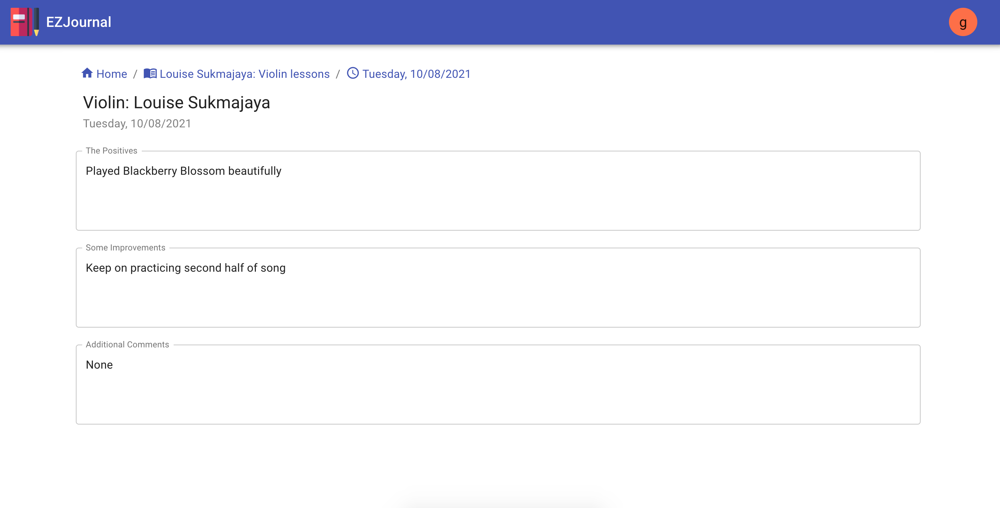

# EZ Journal

An application that tracks all your feedbacks the easy way. 

## User Stories
As a parent,
I want to keep all my child(ren) private lessons notes and feedbacks in one place
So I can easily track their progress and help them improve based on the feedbacks.

As a teacher,
I want to add all my students’ progress on their lessons in one place
So that I can easily refer back to my previous notes
And so that I can easily communicate these feedbacks to the parents

## Technologies
React 
 
React sweet state
 
React router
 
Material UI React
 
Auth0
 
Typescript
 
MongoDB
 
Node
 
Express

## Usage
1. Signup to the application. Your role will automatically be as a parent.
2. Add a child
3. Add a class
4. In another browser (incognito), signup with the teacher's email that was used when you created a class (in step 3)
5. Select the child (created in step 2)
6. Add a lesson for the class
7. If you log back in as a parent, you'll be able to see the lesson notes.

## Screenshots

## Deployed URL
https://ezjournal.herokuapp.com